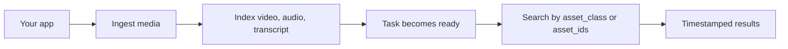

sf-voice media repose sur une boucle principale : soumettre un actif, attendre l'indexation, puis
rechercher dans les médias indexés avec les mêmes identifiants et portées que votre application utilise déjà.



## 1. Les actifs naissent dans votre système

Chaque requête d'ingestion inclut votre `asset_id`. Cela permet de joindre facilement l'API média
à votre base de données, CRM, ticket de support, espace de travail client ou modèle d'objet interne.

```ts
await client.ingest({
  source: "url",
  asset_id: "video_123",
  asset_class: "customer_acme",
  url: "https://example.com/recording.mp4",
});
```

## 2. Les classes d'actifs définissent la portée de recherche

`asset_class` est la primitive publique de regroupement. Utilisez-la pour la frontière qui
compte le plus dans votre produit.

Bons exemples :

- un client final
- un espace de travail
- un projet
- un dépôt
- une collection d'appels de support

<Warning>
  Si vous construisez une recherche destinée aux clients, préférez `asset_class` ou des `asset_ids` explicites.
  La recherche globale doit être une décision produit explicite.
</Warning>

## 3. Les types choisissent les surfaces consultables

`types` contrôle les surfaces que vous indexez ou recherchez.

| Type | Utilisez-le quand |
| --- | --- |
| `video` | Le contenu visuel est important. |
| `audio` | Le son, les locuteurs ou les indices acoustiques sont importants. |
| `transcript` | Les mots prononcés et la récupération textuelle sont importants. |

Vous pouvez combiner les types :

```ts
types: ["video", "audio", "transcript"]
```

## 4. L'indexation est asynchrone

L'ingestion renvoie rapidement un `task_id`. L'actif est consultable une fois que la tâche
atteint l'état `ready`.

```ts
const ingest = await client.ingest(request);
const task = await client.pollTask(ingest.task_id);
```

L'interrogation de la tâche renvoie l'identifiant de l'actif, la classe d'actif, les types indexés, le statut et toute
erreur en cas d'échec de l'indexation.

## 5. La recherche renvoie des correspondances horodatées

Les résultats de recherche incluent `start_ms` et `end_ms` afin que votre interface puisse aller directement
au moment correspondant.

```json
{
  "asset_id": "video_123",
  "score": 0.84,
  "start_ms": 42000,
  "end_ms": 58000,
  "match_type": "transcript"
}
```

Utilisez `threshold` pour contrôler la rigueur. Des valeurs plus élevées renvoient moins de
correspondances mais plus fiables.

## 6. Les détails du fournisseur backend restent cachés

Le SDK n'expose que les concepts sf-voice :

- `asset_id`
- `asset_class`
- `types`
- `threshold`

Les index, identifiants et mappages de types du fournisseur sont gérés par le backend.

<Card title="SDK TypeScript" icon="code" href="/fr/sdks/typescript">
  Consultez la référence API TypeScript complète.
</Card>
