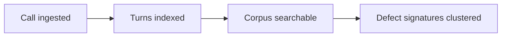

Understanding how Mise works helps you write better queries, interpret defect signatures accurately, and know what to expect when you connect a new stack. This page explains the indexing model, the five acoustic dimensions, and how the pipeline turns raw calls into searchable, clusterable observations.

## Two layers: surface and depth

Every voice conversation has two layers of information.

The **surface layer** is what most tools capture: words, timestamps, speaker labels, and text-derived sentiment. This is what transcription gives you. It's useful, but it's incomplete.

The **depth layer** is how the conversation sounds: the pace of speech, the pitch patterns that signal frustration, the overlap that means interruption, the pause that means confusion. This layer is expressed in audio, not text, and it's what Mise indexes.

<CardGroup cols={2}>
  <Card title="Surface layer" icon="file-lines">
    Transcript text, speaker roles, word timestamps, text-derived sentiment scores. Available from any ASR system.
  </Card>
  <Card title="Depth layer" icon="waveform-lines">
    Tone, prosody, tension, rhythm, and intent — extracted from audio at every turn and indexed alongside the transcript.
  </Card>
</CardGroup>

Mise indexes both layers. Queries can target either, but the depth layer is what makes Mise different from transcript search.

## Indexed by turn, not time series

Most observability platforms index calls as time series — you see what happened at a given timestamp across all calls. Mise indexes by **turn and corpus**.

A turn is the natural unit of a voice conversation: one contiguous segment where a single speaker holds the floor. Each turn gets its own acoustic fingerprint. That fingerprint captures not just what was said in that turn, but how the acoustic features evolved relative to the surrounding turns.

This means you can ask questions that have no answer in a time-series model:

- "Find calls where the agent's pace increased right after a caller hesitation"
- "Find turns where the caller's tone shifted from neutral to frustrated across a three-turn span"
- "Find calls where the agent's interruption rate was higher in the second half than the first"

<Info>
  Mise archives audio per turn and as a full call recording. Turn-level archiving is what makes this kind of indexed search possible — and what powers [Call Replay](/features/call-replay) at exact timestamps.
</Info>

## The five acoustic dimensions

Mise extracts features across five dimensions at every turn.

<AccordionGroup>
  <Accordion title="Tone" defaultOpen={false}>
    **What it captures**: Sentiment, irony, and sarcasm as expressed in the voice.

    Text-derived sentiment misses tone. A caller who says "great, that's really helpful" in a flat, clipped voice is expressing something very different from a caller who says the same words with warmth and pace. Mise captures tone from audio, not from the words.

    Tone is indexed per turn and tracked across a call, so you can see how it shifts — from neutral to frustrated, or from tense to resolved.
  </Accordion>

  <Accordion title="Prosody" defaultOpen={false}>
    **What it captures**: Pace, pauses, and emphasis.

    Prosody is the rhythm of speech: how fast someone talks, how long they pause before responding, which words they stress. These features carry meaning that transcripts discard. A long pause before "yes" means something different from an immediate "yes." An agent who speeds up while explaining a policy may be signaling impatience.

    Mise indexes prosodic features at the turn level and uses them as matching signals for corpus queries.
  </Accordion>

  <Accordion title="Tension" defaultOpen={false}>
    **What it captures**: Frustration and escalation as they develop across a call.

    Tension is not a single-turn signal — it builds. Mise tracks how acoustic markers of frustration (raised pitch, clipped vowels, shortened pauses) accumulate across turns. This allows queries like "calls where tension escalated after the agent transferred the caller" that no single-turn metric can answer.
  </Accordion>

  <Accordion title="Rhythm" defaultOpen={false}>
    **What it captures**: Cadence, interruptions, and speaker overlap.

    Rhythm captures the interaction pattern between speakers: who interrupts whom, how often, and at what point in a call. Overlapping speech — where both speakers are talking simultaneously — is indexed as a distinct acoustic event. This is what powers queries for agent interruption patterns.
  </Accordion>

  <Accordion title="Intent" defaultOpen={false}>
    **What it captures**: What the caller is actually trying to accomplish.

    Intent is inferred from the combination of acoustic context and conversation structure — not just from the literal content of the caller's words. A caller asking "can I speak to a supervisor?" after three failed resolution attempts has a different intent signal than someone asking the same question at the start of a call. Mise captures this distinction.
  </Accordion>
</AccordionGroup>

## How calls flow through the pipeline

When a call is connected through your integrated stack, Mise processes it in four stages:



**1. Call ingested** — Mise receives audio from your stack integration (LiveKit, Twilio, Telnyx, or Pipecat). Per-turn audio segments and the full call recording are archived. Call metadata — from number, to number, start and end time, status — is stored alongside the audio.

**2. Turns indexed** — Each turn is processed independently. The transcript text, speaker role, and acoustic features are extracted and stored as a turn record. Sentiment scores are computed from both text and audio. The turn is linked to its call and to adjacent turns for context.

**3. Corpus searchable** — Once turns are indexed, the call is available in your searchable corpus. Queries run against the full corpus — all indexed turns across all calls — not just against metadata.

**4. Defect signatures clustered** — When a query returns matches, Mise automatically clusters them by acoustic similarity. Calls that match the same query for different underlying reasons are separated into distinct signatures. Each signature represents a coherent defect pattern, not just a keyword overlap.

## Real-time detection vs. after-the-fact analytics

Mise indexes calls as they complete, which means your corpus is continuously updated. You don't need to run a batch job or wait for a daily report. A query you run at noon reflects calls that finished at 11:58 AM.

This is distinct from real-time in-call alerts (which Mise does not provide today). The target use case is **continuous corpus search**: you notice a pattern, you query for it, you get clustered results with representative examples, and you fix the underlying issue in your voice AI stack.

<Warning>
  Mise is not a real-time alerting system. It is an observability and debugging platform. If you need in-call intervention — barge-in, live escalation — that happens in your telephony layer, not in Mise.
</Warning>

## AI-native output

Mise produces structured output designed for LLMs to reason over. This is what makes the [MCP server](/mcp/overview) possible: Claude, Cursor, and Cline can call `voice.query()`, receive defect signature data, and reason about root cause without requiring a human to listen to calls or parse logs.

Each query result is machine-readable: match counts, signature names and counts, representative call IDs, turn-level acoustic summaries. You can pipe this output directly into an LLM debugging session.

```python
results = client.voice.query("calls where the agent interrupted the caller")

# Structured output for LLM reasoning
for sig in results.defect_signatures:
    print(f"Signature: {sig.name}")
    print(f"Count: {sig.count}")
    print(f"Representative call: {sig.example_call}")
    print(f"Acoustic summary: {sig.acoustic_summary}")
```

<Tip>
  The MCP server exposes `voice.query()` as a tool call. Connect it to Claude or Cursor and ask "what are the top defect patterns in my calls this week?" in plain language.
</Tip>

## Next steps

<CardGroup cols={2}>
  <Card title="Corpus search" icon="magnifying-glass" href="/features/corpus-search">
    Learn the full query syntax and how to interpret ranked results.
  </Card>
  <Card title="Acoustic indexing" icon="waveform-lines" href="/features/acoustic-indexing">
    Explore the acoustic features in depth and how they map to query terms.
  </Card>
  <Card title="Defect signatures" icon="triangle-exclamation" href="/features/defect-signatures">
    Understand how clustering works and how to act on signature patterns.
  </Card>
  <Card title="MCP server" icon="robot" href="/mcp/overview">
    Use Claude or Cursor to debug voice AI failures with structured Mise output.
  </Card>
</CardGroup>
