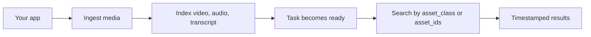

sf-voice media ha un ciclo principale: invia un asset, attendi l'indicizzazione, quindi
cerca nei contenuti indicizzati usando gli stessi ID e ambiti che la tua applicazione utilizza già.



## 1. Gli asset nascono nel tuo sistema

Ogni richiesta di ingestione include il tuo `asset_id`. Questo facilita il collegamento dell'API multimediale
al tuo database, CRM, ticket di supporto, workspace cliente o modello a oggetti interno.

```ts
await client.ingest({
  source: "url",
  asset_id: "video_123",
  asset_class: "customer_acme",
  url: "https://example.com/recording.mp4",
});
```

## 2. Le classi di asset definiscono l'ambito di ricerca

`asset_class` è la primitiva pubblica di raggruppamento. Usala per il confine che conta
di più per il tuo prodotto.

Buoni esempi:

- un cliente finale
- un workspace
- un progetto
- un repository
- una raccolta di chiamate di supporto

<Warning>
  Se costruisci una ricerca rivolta ai clienti, preferisci `asset_class` o `asset_ids` espliciti.
  La ricerca globale dovrebbe essere una scelta di prodotto esplicita.
</Warning>

## 3. I types scelgono le superfici ricercabili

`types` controlla quali superfici indicizzi o cerchi.

| Tipo | Usalo quando |
| --- | --- |
| `video` | Il contenuto visivo è importante. |
| `audio` | Suono, parlanti o indizi acustici sono importanti. |
| `transcript` | Le parole pronunciate e il recupero testuale sono importanti. |

Puoi combinare i tipi:

```ts
types: ["video", "audio", "transcript"]
```

## 4. L'indicizzazione è asincrona

L'ingestione restituisce rapidamente un `task_id`. L'asset diventa ricercabile dopo che il task
raggiunge lo stato `ready`.

```ts
const ingest = await client.ingest(request);
const task = await client.pollTask(ingest.task_id);
```

Il polling del task restituisce l'ID dell'asset, la classe dell'asset, i tipi indicizzati, lo stato ed eventuali
errori se l'indicizzazione fallisce.

## 5. La ricerca restituisce corrispondenze con timestamp

I risultati di ricerca includono `start_ms` ed `end_ms` così la tua UI può saltare direttamente
al momento corrispondente.

```json
{
  "asset_id": "video_123",
  "score": 0.84,
  "start_ms": 42000,
  "end_ms": 58000,
  "match_type": "transcript"
}
```

Usa `threshold` per controllare la rigidità. Valori più alti restituiscono meno corrispondenze,
ma più affidabili.

## 6. I dettagli del provider backend restano nascosti

L'SDK espone solo i concetti di sf-voice:

- `asset_id`
- `asset_class`
- `types`
- `threshold`

Gli indici, gli ID e le mappature dei tipi del provider sono gestiti dal backend.

<Card title="SDK TypeScript" icon="code" href="/it/sdks/typescript">
  Vedi il riferimento API TypeScript completo.
</Card>
